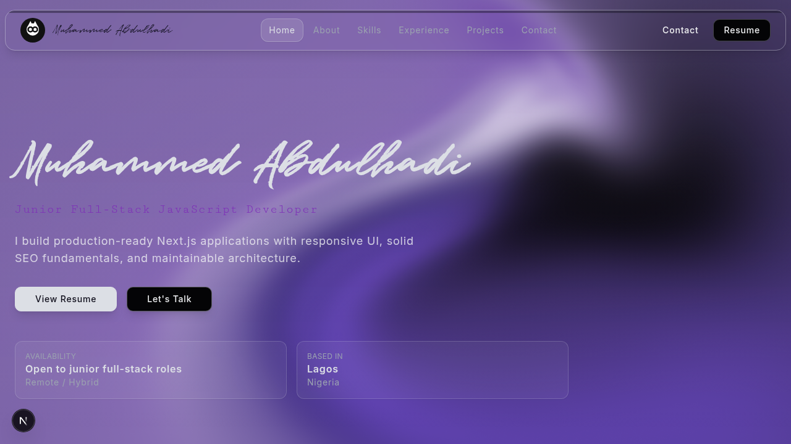

# Muhammed Abdulhadi — Portfolio

[](https://nextjs.org/)
[](https://react.dev/)
[](https://www.typescriptlang.org/)
[](https://tailwindcss.com/)
[](https://vercel.com/analytics)

A recruiter-friendly personal portfolio built with Next.js App Router, focused on polished UI, project storytelling, and clean contact pathways.

## Live Demo Links
- **Portfolio source/demo entry:** https://github.com/mrglasswillbreak/AN
- **GitHub profile (all featured projects):** https://github.com/mrglasswillbreak
- **Resume route (local while developing):** http://localhost:3000/resume

## Screenshot Previews

### Homepage Preview


### About/Profile Visual


## Tech Stack
- **Framework:** Next.js 15 (App Router)
- **Language:** TypeScript + React 19
- **Styling & UI:** Tailwind CSS, Motion, React Icons, Radix Slot
- **Infra/Observability:** Vercel Analytics
- **Backend utilities:** Nodemailer, Validator

## Short Case-Study Snapshots

### 1) Personal Brand Landing Experience
**Challenge:** Present technical depth and personality in a single scrollable narrative that still feels fast and modern.  
**Approach:** Built modular sections (Hero, About, Skills, Experience, Projects, Contact) with animation-enhanced transitions and responsive composition.  
**Outcome:** A cleaner first impression for recruiters with clear role targeting, stronger content hierarchy, and better storytelling flow.

### 2) Recruiter Conversion Signals
**Challenge:** Make it easier for hiring teams to quickly evaluate availability and fit.  
**Approach:** Centralized profile data in constants and surfaced practical hiring details (location, availability, work model, response time) in the contact area.  
**Outcome:** Faster recruiter triage and clearer communication expectations.

### 3) SEO & Discovery Foundation
**Challenge:** Improve discoverability and social-sharing quality.  
**Approach:** Added metadata, Open Graph/Twitter cards, robots/sitemap support, and structured-data helpers.  
**Outcome:** Better indexing readiness and more professional social previews.

## Project Structure
- `src/app` → routes, layouts, metadata, API handlers
- `src/components` → reusable UI blocks and page sections
- `src/constant` → profile, projects, experience, and skill data
- `public/images` → static brand and preview assets

## Local Development
```bash
npm install
npm run dev
```
Then open `http://localhost:3000`.

## Build & Quality Checks
```bash
npm run lint
npm run build
npm run start
```

## Customize Content
Update these files to personalize the portfolio:
- `src/constant/self.ts`
- `src/constant/experience.ts`
- `src/constant/projects.ts`
- `src/constant/skills.ts`
